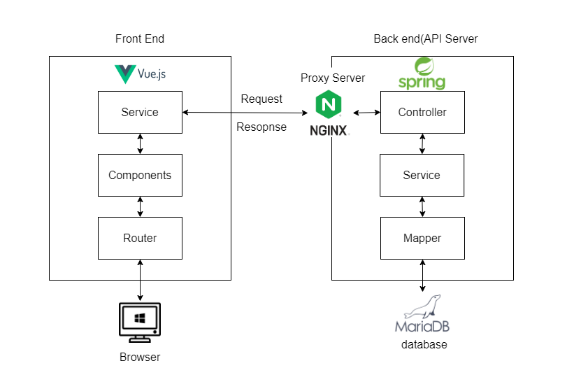
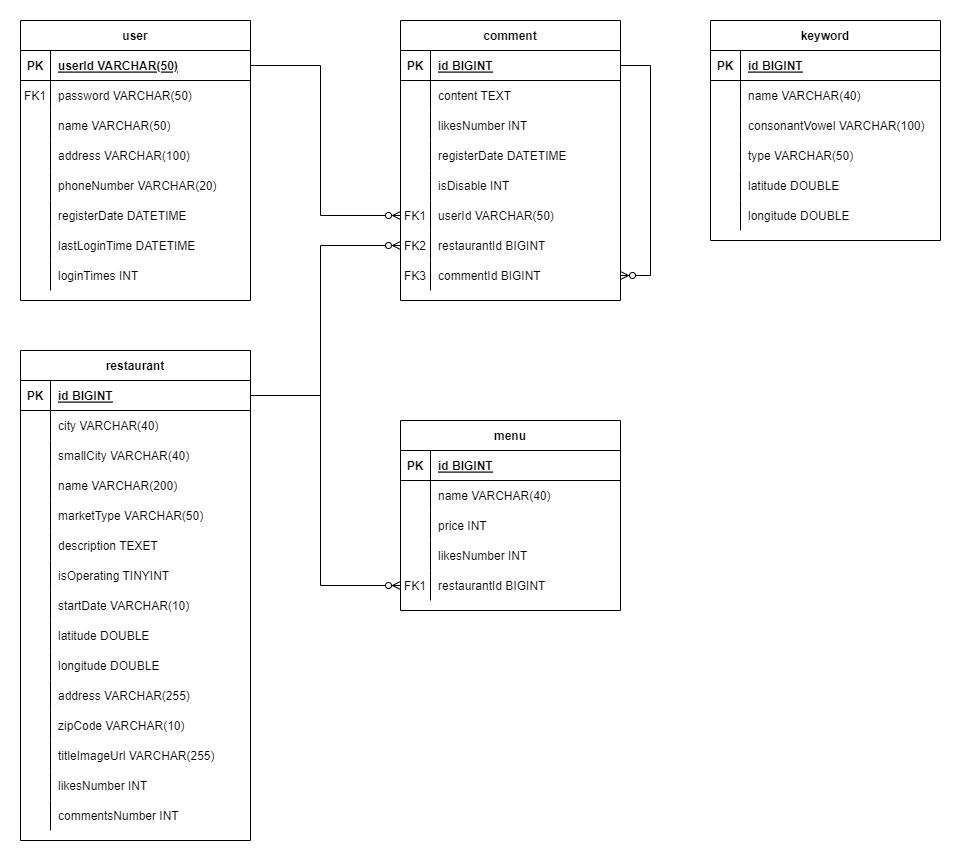

# 식당 검색 사이트
## 개요
 검색 창에 서울시 내의 지하철 역을 검색하면, 지하철 역 인근 식당을 보여주는 기능을 구현을 목표로 삼았음.

## Architecture
1. 프로그램 구성

2. ERD

## 사용 기술
### 키워드 자동완성
* 구현 완료
### 카카오 API를 이용한 로그인 
* 구현 완료
### 서울시 지하철 역 전체 DB 업데이트
* 구현 완료
### 서울시 식당 위경도 DB 저장
* 구현 완료
### 댓글 작성 및 대댓글 작성
* 댓글 작성은 구현 완료 하였으나 대댓글 기능은 아직 추가되지 않음
### 식당별 메뉴 및 이미지 크롤링
* 미 구현
